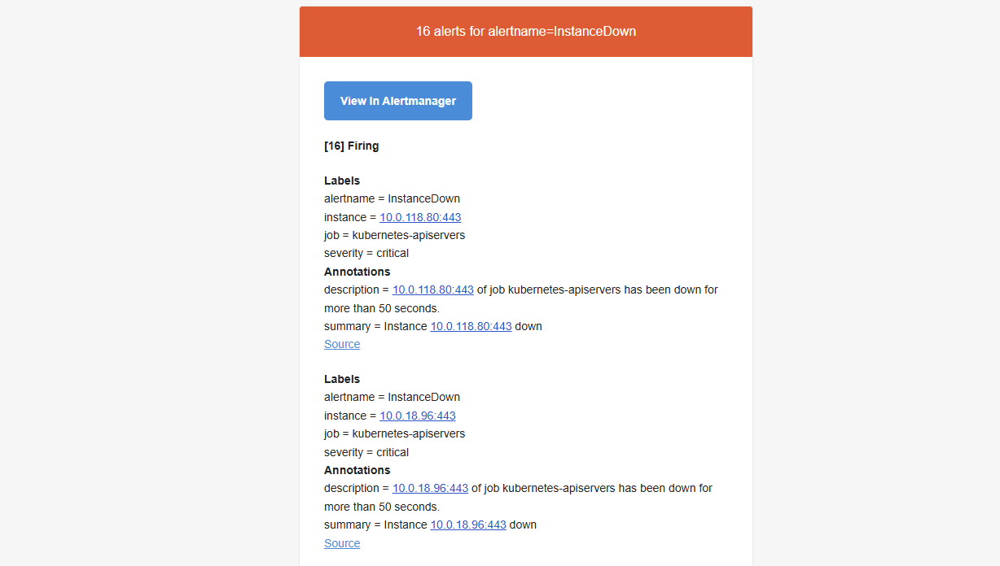

<h1 align="center">⚙️ Production-Grade EKS Deployment with GitOps and Observability</h1>

## Navigation
[Key Features](#key-features) • [Architecture Diagram](#architecture-diagram) •[ArgoCD/Prometheus/AlertManager/Grafana](#ArgoCD) • [App Walkthrough](#App-Walkthrough)

---
This project delivers a production-ready application deployment on Amazon EKS, fully automated using Terraform, CI/CD, and ArgoCD for GitOps. Helm manages the deployment of key Kubernetes components including NGINX Ingress, Cert-manager, External-DNS, Prometheus, and Grafana.

## Key features
- **Amazon EKS**: Provides a fully managed Kubernetes control plane for secure and scalable container orchestration
- **EKS Managed Node Groups**: Provides worker nodes in private subnets to host Kubernetes Pods
- **EKS Pod Identity**: Delivers fine grained IAM permissions directly to pods eliminating node-level credentials and enabling access for resources such as **cert-manager**, **External-DNS**, **EBS-CSI Driver**
- **Terraform**: Provisioned AWS and Kubernetes infrastructure using a consistent, repeatable infrastructure-as-code approach
- **Helm**: Manages deployment of Kubernetes resources including **NGINX Ingress**, **cert-manager**, **External-DNS**, **ArgoCD**, and **Prometheus/Grafana**
- **NGINX Ingress Controller**: Routes external traffic into the cluster and provides SSL/TLS termination 
- **Cert-Manager**: Automates issuance and renewal of TLS certificates through the ACME DNS-01 challenge using Route53 for domain validation
- **External-DNS**: Dynamically creates and updates Route53 DNS records based on Kubernetes Ingress resources
- **Prometheus & Grafana**: Displays application and cluster performance metrics, configured with Persistent Volumes to retain data across restarts
- **ArgoCD**: Implements GitOps based continuous delivery by monitoring changes in the `apps/` directory and automatically applying changes to Kubernetes

# Architecture Diagram

# ArgoCD

# Prometheus

## Configured Prometheus rules

## Prometheus targets  

# AlertManager
## An example of an email alert

# Grafana 

# App Walkthrough

